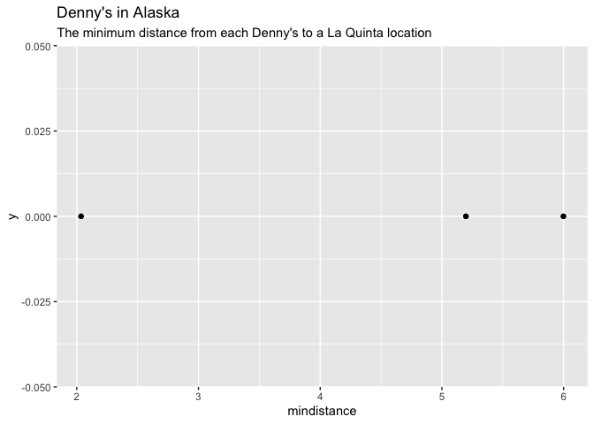
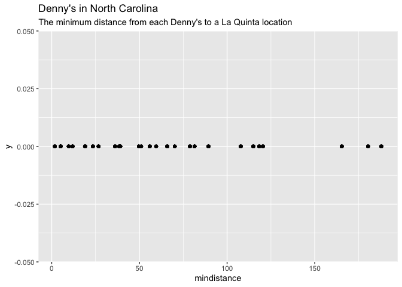
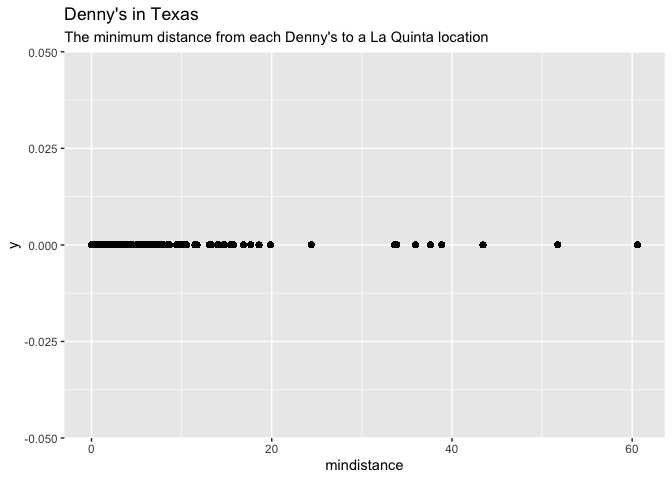
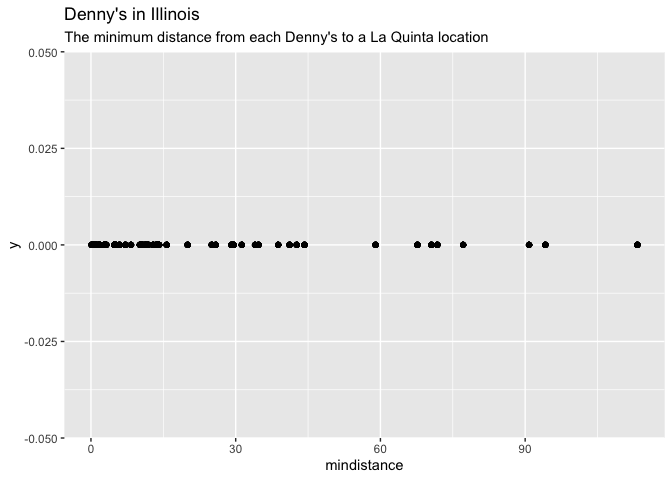

Lab 05 - La Quinta is Spanish for next to Denny’s, Pt. 2
================
Charlize Ezernack
02-17-26

### Load packages and data

``` r
library(tidyverse) 
library(dsbox) 
```

``` r
states <- read_csv("data/states.csv")
```

### Exercise 1

``` r
dn_ak <- dennys %>%
  filter(state == "AK")
nrow(dn_ak)
```

    ## [1] 3

There are 3 Dennys locations in Alaska.

### Exercise 2

``` r
lq_ak <- laquinta %>%
  filter(state == "AK")
nrow(lq_ak)
```

    ## [1] 2

There are 2 La Quinta locations in Alaska.

### Exercise 3

We are looking of 6 pairings of Dennys x La Quinta locations so I will
need to calculate 6 distances between locations.

### Exercise 4

``` r
dn_lq_ak <- full_join(dn_ak, lq_ak,
  by = "state"
)
```

    ## Warning in full_join(dn_ak, lq_ak, by = "state"): Detected an unexpected many-to-many relationship between `x` and `y`.
    ## ℹ Row 1 of `x` matches multiple rows in `y`.
    ## ℹ Row 1 of `y` matches multiple rows in `x`.
    ## ℹ If a many-to-many relationship is expected, set `relationship =
    ##   "many-to-many"` to silence this warning.

``` r
dn_lq_ak
```

    ## # A tibble: 6 × 11
    ##   address.x     city.x state zip.x longitude.x latitude.x address.y city.y zip.y
    ##   <chr>         <chr>  <chr> <chr>       <dbl>      <dbl> <chr>     <chr>  <chr>
    ## 1 2900 Denali   Ancho… AK    99503       -150.       61.2 3501 Min… "\nAn… 99503
    ## 2 2900 Denali   Ancho… AK    99503       -150.       61.2 4920 Dal… "\nFa… 99709
    ## 3 3850 Debarr … Ancho… AK    99508       -150.       61.2 3501 Min… "\nAn… 99503
    ## 4 3850 Debarr … Ancho… AK    99508       -150.       61.2 4920 Dal… "\nFa… 99709
    ## 5 1929 Airport… Fairb… AK    99701       -148.       64.8 3501 Min… "\nAn… 99503
    ## 6 1929 Airport… Fairb… AK    99701       -148.       64.8 4920 Dal… "\nFa… 99709
    ## # ℹ 2 more variables: longitude.y <dbl>, latitude.y <dbl>

There are 12 observations in the joined data frame.

### Exercise 5

We will use the mutate() function to add a new variable into the data
frame while keeping the existing variables.

### Exercise 6

``` r
haversine <- function(longitude.x, latitude.x, longitude.y, latitude.y, round = 3) {
  

  # convert to radians
  long1 <- longitude.x * pi / 180
  lat1 <- latitude.x * pi / 180
  long2 <- longitude.y * pi / 180
  lat2 <- latitude.y * pi / 180

  R <- 6371 # Earth mean radius in km

  a <- sin((lat2 - lat1) / 2)^2 + cos(lat1) * cos(lat2) * sin((long2 - long1) / 2)^2
  d <- R * 2 * asin(sqrt(a))

  return(round(d, round)) # distance in km
  
} 
dn_lq_ak <- dn_lq_ak %>% mutate(distance = haversine(longitude.x, latitude.x, longitude.y, latitude.y))
```

### Exercise 7

``` r
dn_lq_ak <- dn_lq_ak %>% group_by(address.x) %>% mutate(mindistance = min(distance, na.rm = FALSE)) %>% ungroup()

meandennys <- dn_lq_ak %>% 
  summarize(meandennys1 = mean(mindistance, na.rm = TRUE)) 

print(meandennys)
```

    ## # A tibble: 1 × 1
    ##   meandennys1
    ##         <dbl>
    ## 1        4.41

### Exercise 8

``` r
 dn_lq_ak %>% ggplot(aes( x = mindistance, y = 0)) + geom_point() + labs(title = "Denny's in Alaska", subtitle = "The minimum distance from each Denny's to a La Quinta location")
```

<!-- -->

The mean distance of Dennys to the closest La Quinta is 4.41 km in
Alaska.

### Exercise 9

``` r
dn_nc <- dennys %>%
  filter(state == "NC")
nrow(dn_nc)
```

    ## [1] 28

``` r
lq_nc <- laquinta %>%
  filter(state == "NC")
nrow(lq_nc)
```

    ## [1] 12

``` r
dn_lq_nc <- full_join(dn_nc, lq_nc,
  by = "state"
)
```

    ## Warning in full_join(dn_nc, lq_nc, by = "state"): Detected an unexpected many-to-many relationship between `x` and `y`.
    ## ℹ Row 1 of `x` matches multiple rows in `y`.
    ## ℹ Row 1 of `y` matches multiple rows in `x`.
    ## ℹ If a many-to-many relationship is expected, set `relationship =
    ##   "many-to-many"` to silence this warning.

``` r
dn_lq_nc
```

    ## # A tibble: 336 × 11
    ##    address.x    city.x state zip.x longitude.x latitude.x address.y city.y zip.y
    ##    <chr>        <chr>  <chr> <chr>       <dbl>      <dbl> <chr>     <chr>  <chr>
    ##  1 1 Regent Pa… Ashev… NC    28806       -82.6       35.6 165 Hwy … "\nBo… 28607
    ##  2 1 Regent Pa… Ashev… NC    28806       -82.6       35.6 3127 Slo… "\nCh… 28208
    ##  3 1 Regent Pa… Ashev… NC    28806       -82.6       35.6 4900 Sou… "\nCh… 28217
    ##  4 1 Regent Pa… Ashev… NC    28806       -82.6       35.6 4414 Dur… "\nDu… 27707
    ##  5 1 Regent Pa… Ashev… NC    28806       -82.6       35.6 1910 Wes… "\nDu… 27713
    ##  6 1 Regent Pa… Ashev… NC    28806       -82.6       35.6 1201 Lan… "\nGr… 27407
    ##  7 1 Regent Pa… Ashev… NC    28806       -82.6       35.6 1607 Fai… "\nCo… 28613
    ##  8 1 Regent Pa… Ashev… NC    28806       -82.6       35.6 191 Cres… "\nCa… 27518
    ##  9 1 Regent Pa… Ashev… NC    28806       -82.6       35.6 2211 Sum… "\nRa… 27612
    ## 10 1 Regent Pa… Ashev… NC    28806       -82.6       35.6 1001 Aer… "\nMo… 27560
    ## # ℹ 326 more rows
    ## # ℹ 2 more variables: longitude.y <dbl>, latitude.y <dbl>

``` r
haversine <- function(longitude.x, latitude.x, longitude.y, latitude.y, round = 3) {
  

  # convert to radians
  long1 <- longitude.x * pi / 180
  lat1 <- latitude.x * pi / 180
  long2 <- longitude.y * pi / 180
  lat2 <- latitude.y * pi / 180

  R <- 6371 # Earth mean radius in km

  a <- sin((lat2 - lat1) / 2)^2 + cos(lat1) * cos(lat2) * sin((long2 - long1) / 2)^2
  d <- R * 2 * asin(sqrt(a))

  return(round(d, round)) # distance in km
  
} 
dn_lq_nc <- dn_lq_nc %>% mutate(distance = haversine(longitude.x, latitude.x, longitude.y, latitude.y))
```

``` r
dn_lq_nc <- dn_lq_nc %>% group_by(address.x) %>% mutate(mindistance = min(distance, na.rm = FALSE)) %>% ungroup()

dn_lq_nc %>% ggplot(aes( x = mindistance, y = 0)) + geom_point() + labs(title = "Denny's in North Carolina", subtitle = "The minimum distance from each Denny's to a La Quinta location")
```

<!-- -->

``` r
meandennys <- dn_lq_nc %>% 
  summarize(meandennys2 = mean(mindistance, na.rm = TRUE)) 

print(meandennys)
```

    ## # A tibble: 1 × 1
    ##   meandennys2
    ##         <dbl>
    ## 1        65.4

The mean distance of Dennys to the closest La Quinta is 65.4 km in North
Carolina.

### Exercise 10

``` r
dn_tx <- dennys %>%
  filter(state == "TX")
nrow(dn_tx)
```

    ## [1] 200

``` r
lq_tx <- laquinta %>%
  filter(state == "TX")
nrow(lq_tx)
```

    ## [1] 237

``` r
dn_lq_tx <- full_join(dn_tx, lq_tx,
  by = "state"
)
```

    ## Warning in full_join(dn_tx, lq_tx, by = "state"): Detected an unexpected many-to-many relationship between `x` and `y`.
    ## ℹ Row 1 of `x` matches multiple rows in `y`.
    ## ℹ Row 1 of `y` matches multiple rows in `x`.
    ## ℹ If a many-to-many relationship is expected, set `relationship =
    ##   "many-to-many"` to silence this warning.

``` r
dn_lq_tx
```

    ## # A tibble: 47,400 × 11
    ##    address.x    city.x state zip.x longitude.x latitude.x address.y city.y zip.y
    ##    <chr>        <chr>  <chr> <chr>       <dbl>      <dbl> <chr>     <chr>  <chr>
    ##  1 120 East I-… Abile… TX    79601       -99.6       32.4 3018 Cat… "\nAb… 79606
    ##  2 120 East I-… Abile… TX    79601       -99.6       32.4 3501 Wes… "\nAb… 79601
    ##  3 120 East I-… Abile… TX    79601       -99.6       32.4 14925 La… "\nAd… 75254
    ##  4 120 East I-… Abile… TX    79601       -99.6       32.4 909 East… "\nAl… 78516
    ##  5 120 East I-… Abile… TX    79601       -99.6       32.4 2400 Eas… "\nAl… 78332
    ##  6 120 East I-… Abile… TX    79601       -99.6       32.4 1220 Nor… "\nAl… 75013
    ##  7 120 East I-… Abile… TX    79601       -99.6       32.4 1165 Hwy… "\nAl… 76009
    ##  8 120 East I-… Abile… TX    79601       -99.6       32.4 880 Sout… "\nAl… 77511
    ##  9 120 East I-… Abile… TX    79601       -99.6       32.4 1708 Int… "\nAm… 79103
    ## 10 120 East I-… Abile… TX    79601       -99.6       32.4 9305 Eas… "\nAm… 79118
    ## # ℹ 47,390 more rows
    ## # ℹ 2 more variables: longitude.y <dbl>, latitude.y <dbl>

``` r
haversine <- function(longitude.x, latitude.x, longitude.y, latitude.y, round = 3) {
  

  # convert to radians
  long1 <- longitude.x * pi / 180
  lat1 <- latitude.x * pi / 180
  long2 <- longitude.y * pi / 180
  lat2 <- latitude.y * pi / 180

  R <- 6371 # Earth mean radius in km

  a <- sin((lat2 - lat1) / 2)^2 + cos(lat1) * cos(lat2) * sin((long2 - long1) / 2)^2
  d <- R * 2 * asin(sqrt(a))

  return(round(d, round)) # distance in km
  
} 
dn_lq_tx <- dn_lq_tx %>% mutate(distance = haversine(longitude.x, latitude.x, longitude.y, latitude.y))
```

``` r
dn_lq_tx <- dn_lq_tx %>% group_by(address.x) %>% mutate(mindistance = min(distance, na.rm = FALSE)) %>% ungroup()

dn_lq_tx %>% ggplot(aes( x = mindistance, y = 0)) + geom_point() + labs(title = "Denny's in Texas", subtitle = "The minimum distance from each Denny's to a La Quinta location")
```

<!-- -->

``` r
meandennys <- dn_lq_tx %>% 
  summarize(meandennys3 = mean(mindistance, na.rm = TRUE)) 

print(meandennys)
```

    ## # A tibble: 1 × 1
    ##   meandennys3
    ##         <dbl>
    ## 1        5.79

The mean distance of Dennys to the closest La Quinta is 5.79 km in
Texas.

### Exercise 11

``` r
dn_il <- dennys %>%
  filter(state == "IL")
nrow(dn_il)
```

    ## [1] 56

``` r
lq_il <- laquinta %>%
  filter(state == "IL")
nrow(lq_il)
```

    ## [1] 17

``` r
dn_lq_il <- full_join(dn_il, lq_il,
  by = "state"
)
```

    ## Warning in full_join(dn_il, lq_il, by = "state"): Detected an unexpected many-to-many relationship between `x` and `y`.
    ## ℹ Row 1 of `x` matches multiple rows in `y`.
    ## ℹ Row 1 of `y` matches multiple rows in `x`.
    ## ℹ If a many-to-many relationship is expected, set `relationship =
    ##   "many-to-many"` to silence this warning.

``` r
dn_lq_il
```

    ## # A tibble: 952 × 11
    ##    address.x    city.x state zip.x longitude.x latitude.x address.y city.y zip.y
    ##    <chr>        <chr>  <chr> <chr>       <dbl>      <dbl> <chr>     <chr>  <chr>
    ##  1 140 Racehor… Alort… IL    62205       -90.1       38.6 1900 Cen… "\nCh… 61820
    ##  2 140 Racehor… Alort… IL    62205       -90.1       38.6 One Sout… "\nCh… 60606
    ##  3 140 Racehor… Alort… IL    62205       -90.1       38.6 5688 Nor… "\nGu… 60031
    ##  4 140 Racehor… Alort… IL    62205       -90.1       38.6 4900A S.… "\nCh… 60615
    ##  5 140 Racehor… Alort… IL    62205       -90.1       38.6 2000 Sou… "\nBa… 60015
    ##  6 140 Racehor… Alort… IL    62205       -90.1       38.6 1900 Eas… "\nEl… 60007
    ##  7 140 Racehor… Alort… IL    62205       -90.1       38.6 1 South … "\nOa… 60181
    ##  8 140 Racehor… Alort… IL    62205       -90.1       38.6 7255 Wes… "\nTi… 60477
    ##  9 140 Racehor… Alort… IL    62205       -90.1       38.6 855 79th… "\nWi… 60527
    ## 10 140 Racehor… Alort… IL    62205       -90.1       38.6 6 Gatewa… "\nCo… 62234
    ## # ℹ 942 more rows
    ## # ℹ 2 more variables: longitude.y <dbl>, latitude.y <dbl>

``` r
haversine <- function(longitude.x, latitude.x, longitude.y, latitude.y, round = 3) {
  

  # convert to radians
  long1 <- longitude.x * pi / 180
  lat1 <- latitude.x * pi / 180
  long2 <- longitude.y * pi / 180
  lat2 <- latitude.y * pi / 180

  R <- 6371 # Earth mean radius in km

  a <- sin((lat2 - lat1) / 2)^2 + cos(lat1) * cos(lat2) * sin((long2 - long1) / 2)^2
  d <- R * 2 * asin(sqrt(a))

  return(round(d, round)) # distance in km
  
} 
dn_lq_il <- dn_lq_il %>% mutate(distance = haversine(longitude.x, latitude.x, longitude.y, latitude.y))
```

``` r
dn_lq_il <- dn_lq_il %>% group_by(address.x) %>% mutate(mindistance = min(distance, na.rm = FALSE)) %>% ungroup()

dn_lq_il %>% ggplot(aes( x = mindistance, y = 0)) + geom_point() + labs(title = "Denny's in Illinois", subtitle = "The minimum distance from each Denny's to a La Quinta location")
```

<!-- -->

``` r
meandennys <- dn_lq_il %>% 
  summarize(meandennys4 = mean(mindistance, na.rm = TRUE)) 

print(meandennys)
```

    ## # A tibble: 1 × 1
    ##   meandennys4
    ##         <dbl>
    ## 1        23.2

The mean distance of Dennys to the closest La Quinta is 23.2 km in
Illinois.

### Exercise 12 Conclusion

Out of all the analyses over Texas, North Carolina, Alaska, and Illinois
I have come to the conclusion that Hedberg’s joke holds true the most
for Texas. Texas by far has the most observations of pairings of La
Quinta and Dennys locations, and the resulting minimum distance after
analysis is quite small between locations being 5.79km.
